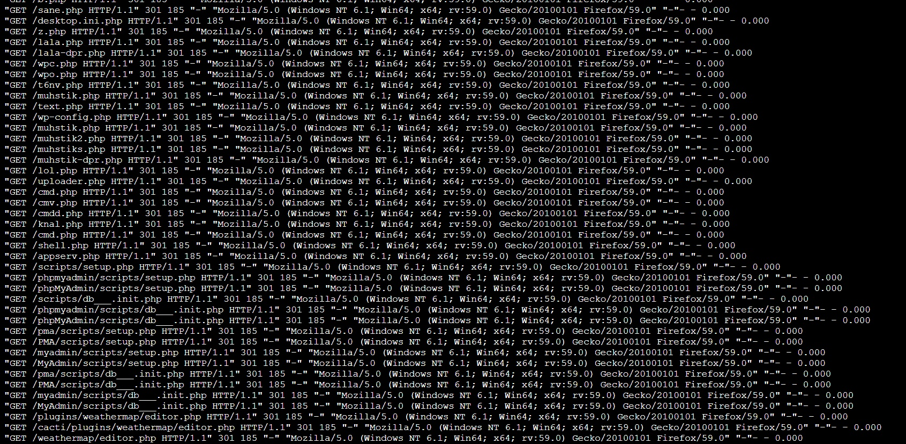
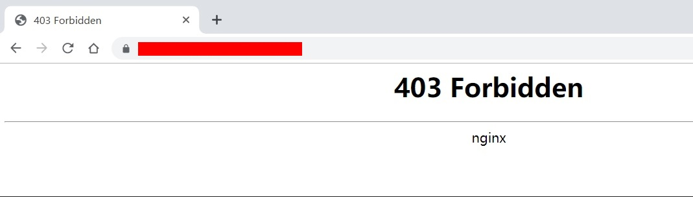

## Nginx拦截指定的请求

某一天，收到安全组的消息，说有一台具有公网IP的代理服频繁被扫描工具扫描PHP有关的漏洞，如图所示。




由于使用iptables防火墙无法对此类请求做拦截，所以需要在nginx这一层做拦截。

##### 第一步：增加https强制跳转

```shell
server {
    listen 80;
    server_name audit.duoyioa.com;
    rewrite ^(.*)$ https://${server_name}$1 permanent;
}
```


##### 第二步：对这类有规律的请求直接拦截

经过咨询安全组，得到这类需要拦截的请求都是以`asp|php|asxp|jspa|action` 结尾的请求，所以按照nginx通配符的方式对这类请求进行拦截。配置如下：

```shell
location ~* /.*\.(asp|php|asxp|jspa|action)$ {
	deny all;
}
```

测试如下：




参考资料：

- [nginx配置location总结及rewrite规则写法](http://seanlook.com/2015/05/17/nginx-location-rewrite/)
- [nginx 常见正则匹配符号表示](https://www.cnblogs.com/netsa/p/6383094.html)