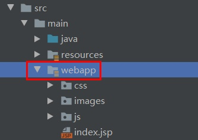
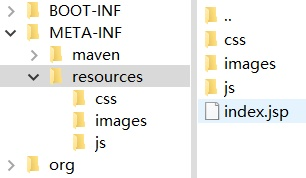

# SpringBoot-Baven打包Jsp

​		事情的起因是需要将宝宝旧的毕设项目重新跑起来，而旧的是使用原生Servlet+Tomcat的方式运行起来，而且我新的电脑上没有安装Tomcat，就算弄好交给宝宝跑起来还是要装环境很麻烦，所以打算使用springboot将项目重新写一遍，这样交给宝宝就可以直接执行main方法或者使用命令`java -jar xxx.jar`的方式直接执行即可。

​		然后呢，问题来了，Spring原生不支持Jsp，而项目里一些页面需要用到jsp的一些特性，所以进过查资料结合尝试整理出下面的内容，以供后用，是可以直接将项目代码打包成可执行jar包的方式。


## 01 添加pom依赖

在`pom.xml`文件中必要的依赖项

```xm
        <!-- 添加servlet依赖模块 -->
        <dependency>
            <groupId>javax.servlet</groupId>
            <artifactId>javax.servlet-api</artifactId>
        </dependency>
        <!-- 添加jstl标签库依赖模块 -->
        <dependency>
            <groupId>javax.servlet</groupId>
            <artifactId>jstl</artifactId>
        </dependency>
        <!--添加tomcat依赖模块.-->
        <dependency>
            <groupId>org.springframework.boot</groupId>
            <artifactId>spring-boot-starter-tomcat</artifactId>
        </dependency>
        <!-- 使用jsp引擎，springboot内置tomcat没有此依赖 -->
        <dependency>
            <groupId>org.apache.tomcat.embed</groupId>
            <artifactId>tomcat-embed-jasper</artifactId>
        </dependency>
```


## 02 新建webapp目录

在`src`目录下新建`webapp\`目录，如图所示：



如果将前端代码放到`resources\`目录下，实际上是检测不到的。


## 03 添加配置信息

在springboot的配置文件中添加如下配置：

```properties
# webapp根目录
spring.mvc.view.prefix=/
# 文件结尾的后缀
spring.mvc.view.suffix=.jsp
```

第一个使用斜线表示前端文件放在webapp的根目录下。（这不是一个好习惯，请不要模仿哦~）

第二个配置信息表示检测`.jsp`文件，Servlet也支持其他模板引擎，如`.vm`等，也可以在此处配置。


## 04 代码中使用

填好配置信息后就可以直接在代码中使用了，例如：

```java
@RequestMapping(value = {"/hello"}, method = RequestMethod.GET)
public String hello(HttpServletRequest request, HttpServletResponse response){
    System.out.println("to hello page~");
    return "hello";
}
```

这样就可以启动springboot项目，通过访问`localhost:8080/hello`访问到该jsp页面了，此处需要注意不能添加`@ResponseBody`注解，实际项目中也不要使用`System.out.println();`打印日志。

那么问题来了，上面的依赖、配置等ok了以后，在开发期间可以正常测试运行，那需要打包部署的时候怎么办呢？


## 05 增加pom打包配置

除了新建springboot项目时，自动添加的springboot打包配置以外，还需要额外补充一些将`webapp\`目录下内容添加到jar包中的配置，完整的`<build>`部分如下所示：

```xml
<build>
    <plugins>
        <plugin>
            <groupId>org.springframework.boot</groupId>
            <artifactId>spring-boot-maven-plugin</artifactId>
            <version>1.4.2.RELEASE</version>
        </plugin>
    </plugins>
    <resources>
        <resource>
            <directory>${basedir}/src/main/webapp</directory>
            <targetPath>META-INF/resources</targetPath>
            <includes>
                <include>**/**</include>
            </includes>
        </resource>
        <resource>
            <directory>src/main/resources</directory>
            <filtering>false</filtering>
            <includes>
                <include>**/**</include>
            </includes>
        </resource>
    </resources>
</build>
```

执行`mvn package`即可看到在`target\`目录下生成好的jar包。

此处需要注意的是，`spring-boot-maven-plugin`的版本填写`1.4.2.RELEASE`即可。下面配置就是将`webapp\`下的文件添加到jar包中的`META-INF/resources`目录下，如图所示：



## 06 执行

在命令行执行`java -jar xxx.jar`即可看到SpringBoot项目正常启动，Jsp页面也可以正常访问到。


有了上面的一系列配置，不管是手动打包执行，还是使用Jenkins等CI工具，都可以正常使用~

