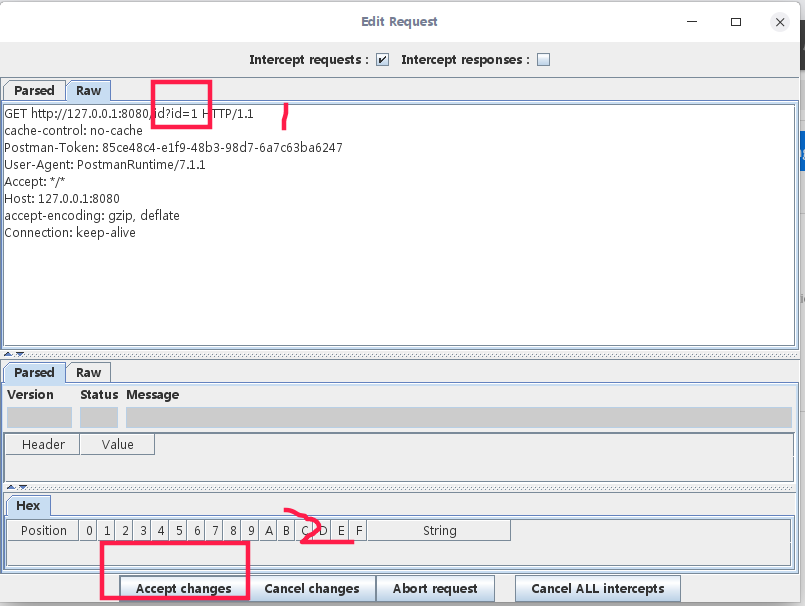

# 写给女盆友的系列之《WebScarab的使用（一）》

#### 01 介绍

WebScarab是一个用来分析使用HTTP和HTTPS协议的应用程序框架。其原理是WebScarab通过代理拦截请求和相应报文可以记录它检测到的会话内容（请求和应答），并允许使用者可以通过多种形式来查看记录。WebScarab的设计目的是让使用者可以掌握某种基于HTTP（S）程序的运作过程；可以用它来调试程序中较难处理的bug，通过WebScarab直接就可以在提交时修改数据发起实时攻击来帮助安全专家发现潜在的程序漏洞。

大致原理呢就相当于通过代理，你在访问页面的时候，它会记录你在请求过程中产生的每一请求以及对应的响应报文，这样就可以得到这个网站的链接图谱。

#### 02 安装

WebScarab是纯Java应用，安装运行时需要预先安装JDK环境，该步骤略过。

以`webscarab-20070504-1631.jar`版本为例，安装时，在当前下载目录打开命令行命令行输入`java -jar webscarab-installer-20070504-1631.jar`，即可打开安装向导，下一步下一步即可。

#### 03 启动

1. 打开命令行进入安装目录，使用`java -jar webscarab.jar`打开WebScarab应用界面，这里需要预先说一下，WebScarab有两种显示模式：**Lite interface**和**full-featured interface**，可在Tools菜单下进行模式切换，需要重启软件生效，修改http请求信息需要在full-featured interface下进行。


2. 打开后的页面如图所示：

   

3. 设置代理，默认端口为8008，即：`127.0.0.1:8008`。具体设置方式，参考pc系统，或者打开谷歌浏览器，进入`设置 -> 高级 -> 打开代理设置`，Windows平台下设置局域网代理，填入刚才的地址即可。我的不是Windows就不演示了。

   此时可能出现如下情况，因为https没有设置证书，谷歌浏览器的安全策略会对该请求进行拦截。

   

#### 04 演示前的准备工作

为了更好的演示，我就临时编写了一个服务端代码来提供HTTP请求。通过本地的打印情况来演示WebScarab的基本功能。当获取到对应的请求时，就在控制台打印当前的请求参数。


由于浏览器无法直接发送POST请求，使用Postman来模拟浏览器真实使用情况。（其实是因为懒不想写页面）

如图所示，获取到了返回内容与请求参数对应起来了。

- GET请求示例：


- POST请求示例：

  

到此环境准备完毕，开始使用WebScarab。


#### 05 使用

在设置代理后，软件会拦截到当前的请求报文和响应报文，同时记录当前的请求的详细信息，双击即可打开。


以post为例，显示打开后的内容


这里把请求体单独截取下来做说明，就是宝宝你说不太懂的地方。这个其实需要了解的是HTTP请求的一系列知识，HTTP是如何表达当前的请求，会用到哪些参数，我先做个大概说明，后续会再给你出一期说明。使用#来当注释。

```
POST http://127.0.0.1:8080/login HTTP/1.1 #POST请求，请求资源路径的url，协议版本1.1
cache-control: no-cache #缓存声明，客户端不使用缓存技术
Postman-Token: 273fc9b8-47e7-44bb-b1bd-7e99009bcaef #这个没啥用
User-Agent: PostmanRuntime/7.1.1 #这个表示客户端设备的信息，我用的是postman，所以是这个，也有可能是浏览器的话就是其他说明浏览器版本，内核等信息，这个你在浏览器F12的开发者工具Network就能看到。
Accept: */* #这个表示客户端接受什么类型的数据，这里的*/*表示任意数据，也有可能是text/json表示接受json格式的数据，这里可以定义的内容非常多。
Host: 127.0.0.1:8080 #请求的域名
accept-encoding: gzip, deflate #接受的压缩类型，这里使用的gzip压缩技术，消息发送和接收前后会对数据进行压缩和解压缩
content-type: multipart/form-data; boundary=--------------------------833047120984752271474537 #这个表示传输的消息的是什么类型的数据，这里的multipart/form-data表示这是一个form表单类型的数据。
Content-length: 275 #请求内容的长度
Connection: keep-alive #是否保持连接，这里是保持长连接，不然每次发送http请求前都要建立TCP三次握手连接，非常消耗资源，使用这个声明就是建立好连接先一致保持着，直到浏览器关闭为止。

#下面的就是这个软件把消息体的内容截取出来了
----------------------------833047120984752271474537
Content-Disposition: form-data; name="name"

zzl
----------------------------833047120984752271474537
Content-Disposition: form-data; name="password"

123456
----------------------------833047120984752271474537--
```


#### 06 拦截

首先在代理一栏打开拦截请求，这样在浏览器发送请求之前会打开拦截到请求体，并可以任意修改请求内容，从而达到篡改消息的目的。实际应用可能就是恶意用户恶意拦截发送请求内容，并修改正常用户在无法修改的内容，达到欺骗服务端的目的。同样使用这个工具就可以检测系统的安全性。


1. 发送GET请求，请求参数id=1。此时软件触发了拦截操作。

   

可以看到，红框1中圈出了请求id的值，然后第二步点击accept changes即可。其中Raw框中的文本可以任意编辑，我将1改成了2，此时回到postman中可以看到。发送的id为1，但是浏览器收到并返回的id为2。即通过软件代理拦截达到篡改请求的目的。


2. 以POST请求为例，参数为name=zzl，password=123456。

   拦截到请求报文，本次以Parser框为例，软件会自动对请求内容格式解析，显示如下。

   

   然后修改请求内容的值，点击Accept changes即可。

   

   如图可以看到，请求的参数是”zzl:123456“，但是实际上发送服务端的是”hd:iloveu“。同样达到了篡改消息请求的内容。

   


#### 07 小总结
   最基本的的功能演示就是这样，该软件也是拦截了http请求，并可以达到修改的目的，可以详细的看到http请求的请求报文，对了解http请求也很有帮助。这个功能也没演示完，只是最基本符合你使用的要求。你实际使用的时候可能参数比较多，那就得看你要修改其中的哪一个有对应含义的了。对试试也就更熟悉了。

   拦截的时候不但可以拦截请求，还可以拦截响应报文，如果做成自动化，那岂不是就相当于中间人攻击一样了。这个下一期可以准备一下环境再演示，今晚的代码写的仓促，不太完善。

   这个软件的其他功能我抽空再玩一玩，了解了以后再给你说。

   

   睡觉啦～

   宝宝晚安～