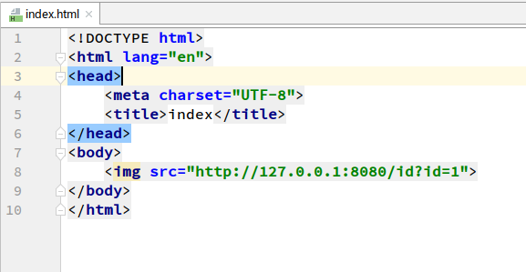
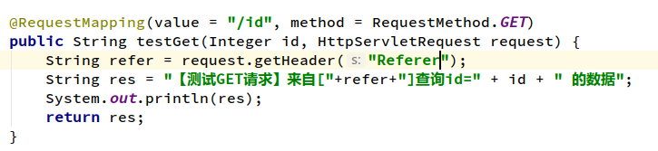
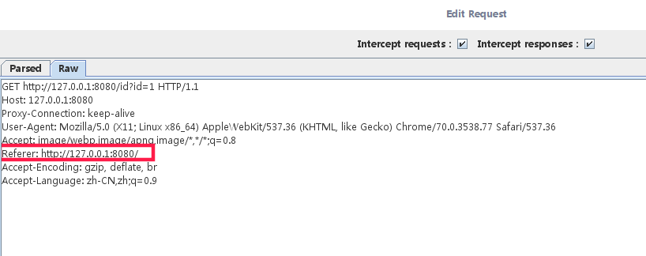
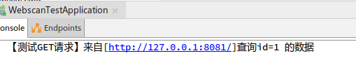

# 写给女盆友系列之《webscarab的使用（二）》

#### 01 引言

第二章的来源呢是用来演示关于跨站请求伪造[CSRF](https://baike.baidu.com/item/CSRF)(Cross Site Request Forgery)，CSRF攻击者在用户已经登录目标网站之后，诱使用户访问一个攻击页面，利用目标网站对用户的信任，以用户身份在攻击页面对目标网站发起伪造用户操作的请求，达到攻击目的。

上面的话是我引用别人说的，网上关于这方面的博客等非常多，可以多参考参考。我大概总结一下来说就是，你在A网站进行了登录操作，我是个坏人，引诱你打开B网站，在B网站里加入一个隐藏的可被自动触发的请求A网站的URL，利用你已经登录了A网站从而触发了一系列操作。这里涉及到了跨域，这个同源策略后面给你说HTTP的时候再给你说吧。

主要目的是结合你的需求演示这个工具如何使用。

#### 02 准备

我新加了一个html页面，引入了一个\的标签，利用src属性自动触发请求，请求的内容就是上一节讲到的GET请求`http://127.0.0.1:8080/id?id=1`。

第二步，为了演示方便，对GET请求的返回值增加了额外的打印信息。

这里读取了Request的Header信息，这个请求头的作用等下再说。

#### 03 演示

下面进行和上一章一样的步骤，设置代理，打开请求拦截，然后请求我们的首页`http://127.0.0.1:8080`，然后就会跳转到我们准备阶段添加的页面并触发img的src请求。

此时我们抓取到了本次的请求内容，这里我们重点关心红框圈起来的内容，[Referer](https://baike.baidu.com/item/HTTP_REFERER/5358396)请求头，他表示当前请求是从哪个连接过来的，这里对应的是`127.0.0.1:8080`，就说明这个链接是从当前8080端口来的请求，属于同源的请求。

这里我们为了演示一个简单的CSRF，手动修改`8080`端口为`8081`，根据浏览器同源策略，此时已经属于跨域请求，表示当前请求的url：`http://127.0.0.1:8080/id?id=1`是从`http://127.0.0.1:8081`这个网站过来的，此时我们看后端的打印情况：

此时我的后端是没有做任何关于CSRF的防护措施，很轻易的就触发了这条查询请求。当然我这里只是用来验证以及说明如何使用WebScarab来进行CSRF的测试，对演示效果没有直观的展示出来。

这里再举个我看到的一个博客里说的例子，你登录了存在CSRF漏洞的银行网站后，不小心点击跳转到了而恶意页面，此时这个恶意页面有一个扣掉你100块钱的请求。这样你刷新一次这个恶意页面看着没什么事情发生，但是你的账户里已经少了100个大洋了。能吃好多辣条呢～

宝宝关于CSRF如何防护暂时没有说明，还是留到下一专门的系列讲吧。晚安呦～

