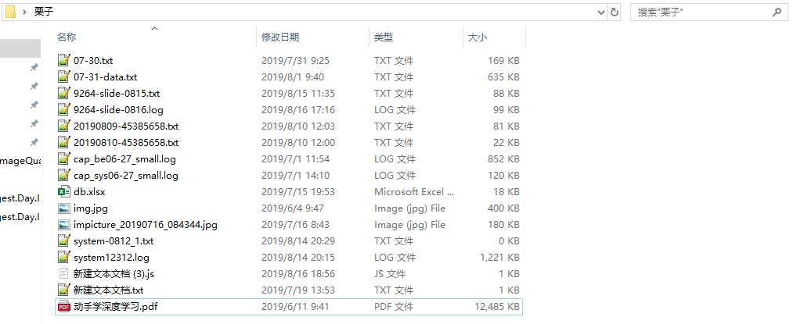
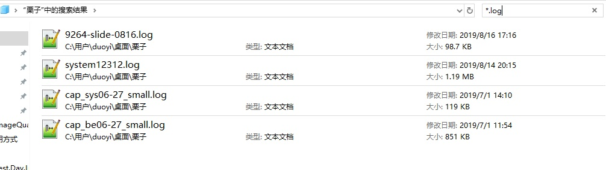
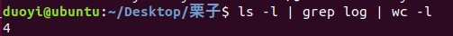

# shell脚本的基本使用

本文不涉及如何编写shell脚本，也尽可能不涉及过多的Linux命令，当然啦，如果碰到了，肯定会加上必要的说明的，宝宝可以放心食用。

## 1. 概述

先大概说一下shell脚本是干啥的，通俗的来说作用就相当于windows下的exe可执行文件一样，只是没有图形化界面而已。

先说说没啥没有图形界面，为什么要这样呢？主要有以下两点。

- 第一点，主要是为了节省资源，linux服务器在运行时都是不带图形化界面的，全是命令行；
- 第二点，多个命令组合可以提高效率，就比如统计一些数据，查找数据等操作，在图像化界面操作的时候需要鼠标点击，需要手动输入如果出错还要重新来。在命令行下就可以直接输入命令即可。

举个小栗子吧：

小栗子：现在有一大堆文件，需要找到log开头的这些日志文件文件，并统计一下有多少个。



通常在文件不多时可以一个一个数，要么在搜索框里输入`*.log`，也是可以的



linux下用命令行的时候直接输入`ls -l | grep log | wc -l`，即可直接得出结果。




说了这么多废话，那shell脚本是啥呢？

当情况复杂起来的时候需要处理的逻辑很多，就没办法一个一个手动输入命令去做，就把所有的命令(或代码)整合到一起形成一个文件来执行。

顺便说一下，python，js等也都可以写成对应的脚本文件来执行。

我的理解就是，可以一次性执行一套完整逻辑或功能的脚本文件，具体用什么语言其实是无所谓的啦~


上面这些就是让对shell和linux命令的关系有个大概了解，不知道你们那边的脚本文件用的什么语言编写的，不过这也不影响使用。下面说一下执行的时候需要关心的东东。


## 2. 执行方式

再放一个栗子吧，下面是一个切割日志的脚本，目的是：每天的日志会往一个文件里面写，这样这个文件会越来越大不利于管理，所以就把当天的那部分日志单独保存起来，第二天重新往这个空的日志文件里面写，这样日志就按照日期整理起来了，要查哪一天的日志也很方便。

```bash
#!/bin/bash
# 定时切割NGINX日志 需配置日志路径和pid
# nginx日志路径
NGINX_LOG_PATH=/var/log/nginx
# pid
NGINX_PID=$(cat /usr/local/nginx/logs/nginx.pid)
YESTERDAY=$(date -d "yesterday" +%Y%m%d)
cd $NGINX_LOG_PATH
# 遍历.log结尾的文件 如果文件不为空且无日期则转储成昨天日期结尾的日志
for file in ${NGINX_LOG_PATH}/*
do
        if [[ -s $file ]] && ! [[ $file =~ [0-9]{8,} ]] ; then mv $file ${file%.*}${YESTERDAY}; fi
done
# nginx重载日志文件
kill -USR1 $NGINX_PID
```

### 2.1 执行方式一

使用`sh script.sh`或`bash script.sh`，后面可以带参数。

### 2.2 执行方式二

在脚本文件所在目录使用`./script.sh`，也是可以的，后面带参数


我现编了一个栗子`concat.sh`，把两个文件内容合并在一起，输出到第三个文件中，那么执行方法如下：

```bash
sh concat.sh file1.txt file2.txt output.txt
```

```bash
./concat.sh file1.txt file2.txt output.txt
```


我又编了另外一种使用AES加密解密的脚本`mima.sh`，根据输入参数和内容，选择加密还是解密:

```bash
sh mima.sh -e "i love you" -p zzl
```

上面的就是`-e`表示加密，后面是加密内容，`-p`是密码，后面是密码内容。（内容没有空格的时候可以不写引号）

那么对应的解密就是：

```bash
sh mima.sh -d "密文" -p zzl
```

通常写脚本文件的人会写一个`-h`参数展示所有参数的作用，可以当做参考。不写这个的开发人员就把他释放掉！


## 3. 注意

大概就是这个样子，对于你们测试来说，内容不用管，先说说执行起来需要注意的几个点。


### 3.1 关注点一：执行程序是什么？

看这个是用什么写的，通常shell脚本以`.sh`结尾，如果是python脚本就是`.py`结尾，如果是js脚本就是`.js`。

也可以打开看文件的第一行，以上面的为例，是`#!/bin/bash`，那就告诉系统用`/bin/bash`来执行这个脚本。

使用`./script.sh`的方式系统会根据那个自己选，使用`sh script.sh`或`bash script.sh`或`ptyhon script.py`就表示我自己选用什么来执行。


### 3.2 关注点二：无法执行？

通常使用指定的程序是不存在这个问题的，但是使用`./script.sh`的方式让系统执行就会碰到这个问题，此时需要执行`chmod +x script.sh`，如果提示无权限就加上`sudo`：`sudo chmod +x script.sh`来给这个脚本添加可执行权限即可。


需要注意的目前想到的可能就上面两种吧，考虑到你们也有写java的，那就再补一个执行Java的写法，有一个jar包需要执行。

```bash
java -jar script.jar param1 [param2 ...]
```

执行单个java文件的情况几乎不存在吧，不过还是写上吧。

```bash
# 先编译成Test.class后，以后就不需要再编译了
javac Test.java
# 再执行，后面不用写.java或.class
java Test
```


