# 第2章 领域、子域和限界上下文

> 本章学习路线图
>
> - 理解**领域**、子域和**限界上下文**
> - 理解战略设计的重要性
> - 学习一个真实的领域，其中包含多个子域
> - 理解限界上下文
> - 看看SaaSOvation是如何开始采用战略设计的

## 总览

从广义上讲，领域（Domain）即是一个组织所做的事情以及其中所包含的一切。商业机构通常会确定一个市场，然后再这个市场中销售产品和服务。每个组织都有它自己的业务范围和做事方式。这个业务范围以及其中所进行的活动便是**领域**。

在DDD中，一个领域被分为若干个子域，领域模型在限界上下文中完成开发。在开发时，我们关注的通常只是这个业务模型的某个方面。几乎所有软件的领域都包含多个子域，

### 工作中的子域和限界上下文

对于如何使用子域，详见书中关于零售商的栗子，或者参考如图所示[美团DDD实践](https://tech.meituan.com/2017/12/22/ddd-in-practice.html)中关于C端抽奖领域的示例。书中以零售商的电子商务系统为例，该领域中包含4个子域：产品目录、订单、发票和物流。当引入新的库存系统时会如何变化？如果这些多个领域模型被融合到一个大而全软件模型时，会对维护带来极大的麻烦。

随着各个逻辑模型引入新的功能，大而全的软件模型将会是个阻碍，特别是引入新的软件模型（子域）时。这些问题的原因通常是由于软件的关注点没有得到清晰的划分所致。

通过使用DDD战略设计工具，我们按照实际功能将这些交织的模型划分为逻辑上相互分离的子域，从而在一定程度上减少系统的复杂性。子域不一定要做的很大，甚至可以简单的只包含一套算法，这种简单的子域可以以**模块**的形式从**核心域**中分离出来。

在实施DDD时，关键在与将限界上下文中领域模型所使用到的每一个**术语**都语言层面上进行上下文界限划分。如“顾客”在浏览商品或是下单时的含义都有所不同，在一个好的限界上下文中，**每个术语应该仅表示一种领域概念**。在DDD中，应该给每个概念给出明确定义，并应用在定义和建模中。

### 将关注点放在核心域上

从字面意思就可以理解，**核心域**是整个业务领域的一部分，也是业务成功的主要促成因素。另外还有支撑子域和通用子域为整个业务保驾护航。

> 书中说要聚焦核心域，但是每一个都很重要~

## 战略设计为什么重要

书中以SaaSOvation公司项目中用户权限举例说明为什么战略设计重要，详细推理过程详见书中描述。总得来说就是分析开始时，不要关注与具体的**实体**和**值对象**之间的结合关系，优先从业务领域角度划限界上下文及依赖关系。**战略设计和战术设计是站在DDD的角度进行划分。战略设计侧重于高层次、宏观上去划分和集成限界上下文，而战术设计则关注更具体使用建模工具来细化上下文。**[^1]

## 现实世界中的领域和子域

领域中还同时存在**问题空间**和**解决方案空间**。在问题空间中我们思考的是业务所面临的挑战，而在解决方案中我们思考如何通过软件以解决这些业务挑战。

- 问题空间是领域的一部分，对问题空间的开发将产生一个新的核心域。
- 解决方案包括一个或多个限界上下文，即一组特定的软件模型。

书中以大型ERP系统为例，给出了在实施某个解决方案之前我们需要对问题空间和解决方案评估的几个问题（问题略）。问题空间由战略核心域及其支撑子域组成，因此我们需要充分评估核心域的目标及其所需的支撑子域，并确保所有利益相关方在核心域的目标达成一致。

对于问题空间的评估有益于理解解决方案空间，很大程度上收到**现有**系统和技术的影响。请记住，开发核心域的解决方案是一种关键性业务投入。

## 理解限界上下文

限界上下文是一个显式的边界，领域模型便存在于这个边界之内。领域模型把通用语言表达成软件模型并准确反应其中所有术语和词组的特性含义。创建边界的原因在于每一个模型概念，包括它的属性和操作，在边界之内都具有特殊的含义。如图所示“Account”光看名字无法区分两种账户的区别，只有通过其所在的限界上下文才能看出区别，甚至这两个限界上下文都不属于同一个领域。

下面例子中，同一个领域的不同限界上下文使用相同的概念名：图书出版社在处理图书生命周期时存在不同的阶段。从计划立项、联系作者编写、排版设计、翻译出版、市场营销到最终销售，每一个阶段中“图书”都有不同的定义，每个环节对于图书的关注点都有所不同。如果使用单一的大而全的模型会导致一系列问题出现。为此我们应该为每个阶段创建各自的限界上下文，并对图书对象共享同一个**身份标识**。

### 限界上下文不仅仅只包含模型

限界上下文不止局限于容纳模型，它通常标定了一个系统、一个应用程序或者一种业务服务。当模型驱动着数据库Schema设计时，此时的数据库Schema也应该位于该模型所处的限界上下文之中。

通常一个系统的使用者不只是人，还可能是另外的计算机系统，我可能可以使用**开放主机服务**（如REST、SOAP或消息服务端点等）。这些面向服务的组件也应该位于限界上下文之中。

总结：限界上下文主要用来封装通用语言和领域对象，但同时它也包含了那些为领域模型提供交互手段和辅助功能的内容。

### 限界上下文的大小

限界上下文应该足够大，以能够表达它所对应的整套通用语言。核心领域之外的概念不应该在其中，同样也尽可能不要遗漏任何重要的概念。我们要充分考虑领域专家（SE？）所讲的通用语言，将核心域中的概念自然而然的组织成单一的语言。需要注意为了分配开发任务而拆分限界上下文是种错误的建模方式。

## 示例上下文

书中距离SaaSOvation团队选择3个限界上下文与各自对应子域的关系时的一些分析经验。限界上下文分别是：

- 敏捷项目管理上下文（核心）
- 协作上下文（支撑）
- 身份与访问上下文（通用）

过程略

## 参考资料：

[^1]: [领域驱动设计在互联网业务开发中的实践 - 美团技术团队 (meituan.com)](https://tech.meituan.com/2017/12/22/ddd-in-practice.html)

