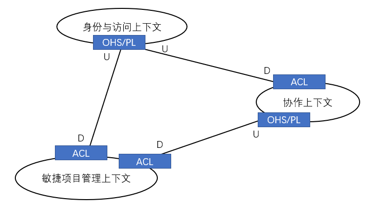

# 第3章 上下文映射图

> 本章学习路线图
>
> - 学习为什么绘制上下文映射图有助于项目成功
> - 学习一个真实的领域，其中包含多个子域
> - 学习绘制上下文映射图
> - 学习常见的组织关系和系统关系，看看他们是如何影响你的项目的
> - 学习SaaSOvation团队是如何利用上下文映射图来控制他们的项目的

## 上下文映射图为什么重要

如图所示通过简单的框图绘制一个抽象领域的上下文映射图，其中U表示上游（Upstream），D表示下游（Downstream）。上下文映射图主要帮助我们从解决方案空间的角度看待问题。

有时需要与**大泥球**进行交互，你的映射图也需要反映出与他们的集成关系，因为这样可以使你了解到映射图的内部，并且可以指明在哪些地方需要与其他团队进行交流。在与大泥球进行交互期间，关系会处于**客户方-供应方**，若依赖大泥球而对方无法做出改变，团队会陷入一种**尊奉者**的关系中。尽早绘制上下文映射图，可以迫使你思考你的项目与所依赖项目之间的关系。

### 绘制上下文映射图

绘制一个上下文映射图通常并不复杂，首选在白板/草稿纸上进行手绘，包含不同的界限上下文、他们之间的关系、各个上下文的团队、上下文之间的集成和必要的翻译等。向框图加入过多的细节对团队并无太大帮助，交流才是关键。

上下文映射图并不是一种企业架构，也不是系统拓扑图。但是它可以用于高层次的架构分析，指出诸如集成瓶颈之类的架构不足。上下文映射图展现了一种组织动态能力，它可以帮助我们识别出有碍项目进展的管理问题。

### 产品和组织关系

> 案例中SaaSovation公司的三个产品：
>
> - CollabOvation：一款社交协作软件。
> - IdOvation：一款可重用的身份和访问管理产品。
> - ProjectOvation：一款敏捷项目管理产品。
>
> CollabOvation是该公司第一个**核心域**。开发团队后来从CollabOvation中提取出来IdOvation模型。对于CollabOvation来说，IdOvation是一个**通用子域**，而CollabOvation本身又作为PorjectOvation的**支撑子域**。ProjectOvation是该公司新的核心域。            

这些界限上下文之间的关系、不同开发团队之间的关系在DDD中存在多种组织模式和集成模式。以下定义很大程度上来自于[Evabs, Ref]（详情在此暂不做介绍，以书中P79描述为准）。

- 合作者
- 共享内核
- 客户方-供应方开发
- 尊奉着
- 防腐层
- 开放主机服务
- 发布语言
- 另谋他路
- 大泥球

在上下文映射图中，我们使用以下缩写来表示各种关系：

- ACL表示防腐层
- OHS表示开放主机服务
- PL表示发布语言

### 映射3个示例界限上下文

分析过程略，下图为SaaSOvation公司项目间的集成关系：

对于任何上下文的边界，任何进入边界的外部概念都应该持有充分的理由，甚至需要和边界内的模型保持良好的兼容性。界限上下文的通用语言维持了所有模型的纯洁性。语言上的分离有助于各个团队将经历集中在各自的界限上下文上。

注意图中上游系统的连接框，他们都标以OHS/PL，分别表示开放主机服务和发布语言。所有下游系统的连接框都标以ACL，即防腐层。对于他们的技术实现将在**集成界限上下文(13)**中详细说明。简单来说，这些集成技术采用以下技术：

- 开放主机服务：REST接口、RPC、消息队列等

- 发布语言：JSON、XML等

- 防腐层：适配层，获取数据解析成内部处理需要的格式。

  > 注：本书中比较严谨的说法是：客户端的领域服务将访问远程的开放主机服务，远程服务机器以发布语言的形式返回，下游的防腐层将 返回内容翻译成本地上下文的领域对象。
  >
  > 好好的适配层或者代理层的非得用极其严谨的DDD的语法进行描述，大大提升阅读难度。💩

我们不应该将重点放在技术实现或者集成产品上，而应该放在界限上下文之间的分离上，这样我们可以保持每个上下文的纯洁性，同时将一个上下文中的数据用在另一个上下文的概念中。

三个界限上下文之间的集成和交互使用到的诸如REST、消息队列等技术细节不进行描述，重点关注各个界限上下文之间的集成。我们应该将有助于团队交流的高层次元素加入上下文映射图中，而不是冗繁的细节。

有些项目可能并不需要达到本章所讲到的细节程度，有些项目却可能需要更多的细节，对此需要进行平衡。保持简单性和敏捷性，拒绝繁文缛节，这样我们创建的上下文映射图将对项目起到推动作用，而不是阻碍作用。