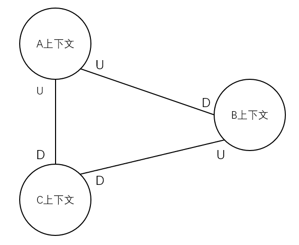

# 第3章 上下文映射图

> 本章学习路线图
>
> - 学习为什么绘制上下文映射图有助于项目成功
> - 学习一个真实的领域，其中包含多个子域
> - 学习绘制上下文映射图
> - 学习常见的组织关系和系统关系，看看他们是如何影响你的项目的
> - 学习SaaSOvation团队是如何利用上下文映射图来控制他们的项目的

## 上下文映射图为什么重要

如图所示通过简单的框图绘制一个抽象领域的上下文映射图，其中U表示上游（Upstream），D表示下游（Downstream）。上下文映射图主要帮助我们从解决方案空间的角度看待问题。

有时需要与**大泥球**进行交互，你的映射图也需要反映出与他们的集成关系，因为这样可以使你了解到映射图的内部，并且可以指明在哪些地方需要与其他团队进行交流。在与大泥球进行交互期间，关系会处于**客户方-供应方**，若依赖大泥球而对方无法做出改变，团队会陷入一种**尊奉者**的关系中。尽早绘制上下文映射图，可以迫使你思考你的项目与所依赖项目之间的关系。

TODO：添加新术语的引用

### 绘制上下文映射图

TODO