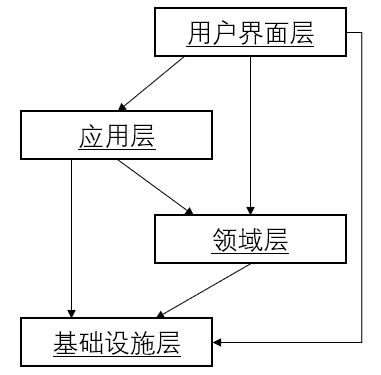
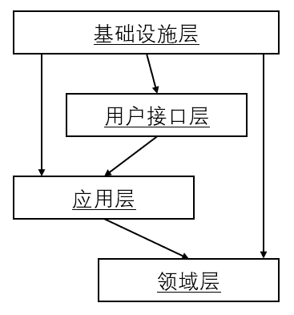
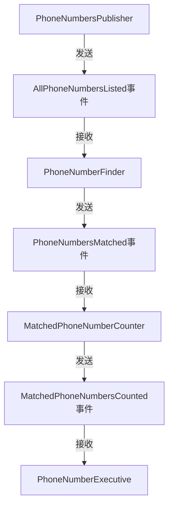

# 第4章 架构


> 本章学习路线图
>
> - 听听SaaSOvation的CIO是如何做项目回顾的
> - 学习使用依赖注入原则（DIP）和六边形（Hexagonal）架构来改进分层架构（Layer Architecture）
> - 学习六边形架构对SOA和REST的支
> - 学习数据网织（DataFabric）或基于网格的分布式缓存（Grid-Based Distributed Cache）和事件驱动风格
> - 学习DDD世界的新架构模式——CQRS
> - 学习SaaSOvation所才用的架构


DDD的一大好处便是它并不需要使用特定的架构。由于核心域位于界限上下文中，我们可以在整个系统中使用多种风格的结构。质量驱动的架构选择是种风险驱动方式，即我们采用的架构是减少失败风险的，而不是增加失败风险的。


## 采访一个成功的CIO

> 访谈过程略，摘抄几句对话要点

- 随着软件复杂性的增加，我们需要引入**单元测试**和**功能测试**来保证软件质量。
- 采用**聚合模式**和**资源库**，在开发时可以采用内存持久化，因为使用了相同的资源库接口，之后又可以方便地切换到其他持久化机制。
- 有些功能需要一系列分布式处理，为了不让用户久等，引入了一套完整的**事件驱动架构**，使用管道和过滤器来完成该功能。
- 某些要求需要跟踪对系统的每一次改变，解决这个事情最好的方式便是**事件源**。


## 分层0                                                                                                                                                                                                                                                                                                                                                                                                                                                                                                                                                                                                                                                                                                                                                                                                                

在分层架构中，我们将领域模型和业务逻辑分离出来，并减少对特定基础设施、用户界面甚至应用层逻辑的依赖，因为他们不属于业务逻辑。将一个复杂的系统分为不同的层，每层都应该具有良好的内聚性，并且只依赖于比其自身更低的层。

如图所示为一个典型的DDD传统分层结构，其中核心域只位于架构中的其中一层，上面是用户界面层和应用层，下面是基础设施层。




分层架构的一个重要原则是：每层只能与位于其下方的层发生耦合。用户界面只用于处理用户显示和用户请求，它不应该包含领域或业务逻辑。（其他特殊情况可以灵活，但原则不变）

当领域模型用于发布**领域事件**时，应用层可以将订阅方注册到任意数量的事件上，这样的好处是可以对事件进行存储和转发；同时领域模型只需要关注自己的核心逻辑；**领域事件发布器**可以保持轻量化而不依赖消息机制的基础设施。

有时，领域层多少需要使用到基础设施层，比如持久化机制。遵从分层架构原则并不意味领域对象要与基础设施层发生直接耦合，此时我们可以才用**模块**的方式来因层细节。

> `com.saasovation.agilepm.domain.model.product.impl`

更好的办法参考下文的“依赖倒置原则”，调整一下分层架构中各层的顺序。


### 依赖倒置原则

依赖倒置原则定义：

- 高层模块不应该依赖于底层模块，两者都应该依赖于抽象
- 抽象不应该依赖于细节，细节应该依赖于抽象。

根据该定义，低层服务应该依赖于高层组件所提供的接口。架构中才用依赖倒置原则有多种表达方式，我们选择其中一种，如图所示：



> 我们将基础设施层放在所有层的最上方，这样它可以实现所有其他层中定义的接口。

当我们将关注点放在领域层上，采用依赖倒置原则，使领域层和基础设施层都只依赖于由领域模型所定义的抽象接口。由于应用层是领域层的直接客户，它将依赖于领域层的接口，并间接的访问资源库和由基础设施层提供的实现类。应用层可以采用不同的方式来获取这些实现，包括**依赖注入**、**服务工厂**和**插件**。


## 六边形架构（端口与适配器）

在六边形架构中，不同的客户通过”平等“的方式进行交互。当需要新客户时，只需要添加一个新的适配器将客户输入转化成能被系统API理解的参数就可以。对于每种特定的输出，都有一个新建的适配器负责完成相应的转化功能。并且依赖注入的架构自然而然地具有端口与适配器的风格。

我们通常将客户与系统交互的地方称为”前端“，同样将系统中获取、存储持久化数据和发送输出数据的地方称为”后端“。在六边形架构中存在两个区域，分别是”外部区域“和”内部区域“。在外部区域中，不同的客户均可以提交输入；而内部的系统则用于获取持久化数据，并对程序输出进行存储（如数据库），或者中途将输出转发到另外的地方。

六边形每条边都代表不同类型的端口，要么处理输入，要么处理输出。端口可以很灵活的使用诸如http、AMQP等协议进行交互，主要在相应的时刻有相应的适配器处理即可。

TODO 图4.4

六边形架构的好处之一在于我们可以轻易的开发用于测试的适配器，整个领域模型和应用程序可以在没有客户和存储机制的条件下进行设计开发。这样我可能可以在核心域上进行持续开发，而不需要考虑支撑性的技术组件。


## 面向服务架构

面向服务架构SOA，书中展示由ThomasEr给出的一些SOA原则。服务除了拥有互操作性外，还具有一下8种设计原则。

| 服务设计原则 | 描述                                                         |
| ------------ | ------------------------------------------------------------ |
| 服务契约     | 通过契约文档，服务阐述自身的目的与功能                       |
| 松耦合       | 服务将依赖关系最小化                                         |
| 服务抽象     | 服务只发布契约，而向客户隐藏内部逻辑                         |
| 服务重用性   | 一种服务可以被其他服务所重用                                 |
| 服务自治性   | 服务自行控制环境与资源以保持独立性，这有助于保持服务的一致性和可靠性 |
| 服务无状态性 | 服务负责消费方的状态管理，这不能与服务的自治性发生冲突       |
| 服务可发现性 | 客户可以通过服务元数据来查找服务和理解服务                   |
| 服务组合性   | 一种服务可以由其他服务组合而成，而不管其他服务的大小和复杂性如何 |


消费方可以通过REST、SOAP和消息机制获取服务。一个六边形架构系统支持多种类型的服务端点（endpoint），这依赖于DDD是如何应用于SOA的。 针对SOA的定义和价值存在的歧义可以在某一点达成一致：**业务服务可以由任意数目的技术服务来提供**。技术服务可以是REST资源、SOAP接口或者消息类型。业务服务强调业务战略，即如何对业务和技术进行整合。

在使用DDD时，我们所创建的界限上下文应该包含一个完整的，能很好的表达通用语言的领域模型。架构不应该对领域模型的大小产生影响，但如果一个或多个技术服务端点会决定到界限上下文的大小，结果会产生许多非常小的界限上下文和领域模型。对于通用语言来说，这种方式会起到分化破坏作用。


## REST

### REST作为一种架构风格

架构风格之于架构就像设计模式之于设计一样。它将不同架构实现所共有的东西抽象出来，使得我们在谈及架构时不至于陷入到技术细节中。分布式系统架构存在着多种架构风格，包括客户端-服务器架构风格和分布式对象风格。而REST就应该是属于Web架构的一种架构风格。


### REST和DDD

不建议将领域模型直接暴露给外界，因为这样会使得系统变得脆弱，原因在于对领域模型的每次改变都会导致对系统接口的改变。将两种方式结合有两种方法。

第一种方法是为系统接口层单独创建一个界限上下文，再在此上下文中通过适当的策略来访问实际的核心模型。它将系统看做一个整体，通过资源抽象将系统功能暴露给外界，而不是通过服务或者远程接口。这种方法应该被优先考虑，因为它在核心域和系统接口模型之间完成了解耦，使得我们可以先做修改，再决定哪些修改应该反应到系统接口模型上。

另一种方法用于需要使用标准媒体类型的时候。我们可以创建一个领域模型来处理每一种媒体类型，并且能在服务器和客户端之间进行重用。


### 为什么是REST？

从作者经验来看，符合REST原则的系统具有更好的松耦合性和可伸缩性，基于REST的系统被分为很多较小的资源块，每一个资源块都可以独立地测试和调试，并且每一个资源块都表示了一个可重用的入口点。HTTP设计本身以及URI成熟的重写与缓存机制使得RESTful HTTP成为一种不错的架构。


## 命令和查询职责分离——CQRS

从资源科中查询所有需要显示的数据是困难的，特别是在需要显示来自不同聚合类型与实例的数据时。此时我们需要从不同的资源库获取聚合实例，然后再组装成一个**数据传输对象(Data Transfer Object, DTO)**。

另一种方法则是通过**CQRS(Command-Query Respensibility Segregation)**将领域数据映射到界面显示中。

> 一个方法要么是执行某种动作的命令，要么是返回数据的查询，而不能两者都是。换句话说，问题不应该对答案进行修改。

最对象层面，这意味着：

1. 如果一个方法修改了对象的状态，该方法便是一个命令，它不应该返回数据。在Java或C#中，这样的方法返回值应该声明为void。
2. 如果一个方法返回了数据，该方法便是一个查询，此时它不应该通过直接或者间接的手段修改对象的状态。

在DDD中，现在对于一个模型，考虑将那些纯粹的查询功能从命令功能中分离出来。聚合将不再有查询方法，只有命令方法。具体的更多操作详见书中描述。

> 埋个坑，等了解更多CQRS的架构风格后再填。😃


## 事件驱动架构

> 事件驱动架构是一种用于处理事件的生成、发现和处理等任务的软件架构。

一个系统的输出端口所发出的领域事件被发送到另一个系统的输入端口，此后输入端口的事件订阅方将对事件进行处理。在一个界限上下文处理某个事件时，应用程序API将采用该事件模型中的属性值来执行响应的操作。应用程序API所执行的命令操作将反映到命令模型中。


### 管道和过滤器

> 基于消息的系统通常都呈现出一种管道和过滤器风格。

以下的shell命令就是一种最简单的管道和过滤器，具体的解释略。

```bash
cat phone_numbers.txt | grep 303 | wc -l
```

作者通过shell命令发现和事件驱动架构的一些共性，并给出了一个具体的例子来做演示：



个人理解简化后比较符合java的Strem流式处理，也是通过一系列的过滤、处理操作获得另外一个数据（集）。

> 单点或者分布式，类似spark吧

```java
dataList.stream().filter().map().collect()
```


### 长时处理过程

对上面管道和过滤器的例子进行扩展可以得到另一种事件驱动的、分布式的并行处理模式——长处理过程。长时处理过程启动多个并行的处过程，然后对其进行跟踪。（例子略）

> 设计长时处理过程的三种不同方法：
>
> - 将处理过程设计成一个组合任务，使用一个执行组件对任务进行跟踪，并对各个步骤和任务完成情况进行持久化。
> - 将处理过程设计成一组聚合，这些聚合在一系列的活动中互相协作。一个或多个聚合实例充当执行组件并维护整个处理过程的状态。
> - 设计一个无状态的处理过程，其中每一个消息处理组件都将对接收到的消息进行扩充——即向其中加入额外的数据信息——然后再将消息发送到下一个处理组件。在这种方法中，整个处理过程的状态包含在每条消息中。


在实际的领域中，一个长时处理过程的执行器将创建一个新的类似聚合的状态对象来跟踪事件的完成情况。该状态对象在处理过程开始时创建，它将与所有的领域事件共享一个唯一标识。当并行处理的每个执行流运行完毕时，执行器都会接收到相应的完成事件。

> 参考java中的**FutureTask**模型，通过isComplete()方法检测任务流是否执行完成；通过timeout设置最大超时时长；


**长时处理过程需要的是最终一致性。**


### 事件源

书中的定义：对于聚合上的每次命令操作，都有至少一个领域事件发布出去，该领域事件描述了操作的执行结果。

> 个人理解和Spring提供的面向切面编程的思想相似，在请求事件的接收和返回阶段记录事件输入和结果到**事件存储**（如日志），通过这些历史事件就可以重建该聚合实例。同样mysql的bin-log，redis的AOF也是这种思想。


##  数据网织和基于网格的分布式计算

随着软件系统越来越复杂，用户越来越多，需求更加“大数据”化，传统的数据库可能会成为性能瓶颈，数据网织（Data Fabric）——有时也被称为网格计算——可以满足这种性能上的需求。分布式缓存可以非常容易的对领域模型进行持久化，此时可以将它看成是一种聚合存储。简单的说，在数据网织中，聚合即是基于图的缓存中的值部分，而聚合的唯一标识则是标识键。

> 有些NoSql存储也可以作为自然的聚合存储，用来简化DDD的技术实现。

```java
String key = product.productId().id();
byte[] value = Serializer.serialized(product);
region.put(key, value);
```


### 数据复制

具有多节点的数据网织则是可靠的，根据有可能的失效数目，可以选择不同层次的数据冗余性。由于多个缓存节点的存在，失效的几率随之变小。

> 就是分布式存储集群的概念


### 事件驱动网织和领域事件

数据网织可以很好地支持事件驱动架构风格，大多数的数据网织都有内建的事件支持，即可以对缓存层面和入口层面上所发生的操作自动地发出时间通知。数据网织是支持开放架构的，因此应该有种方法可以从聚合中直接发布领域事件。

对于领域事件的订阅方来说，他们可以将事件用于同步的更新其他相关的聚合，由此最终一致性也得到了保证。


### 持续查询

客户端可以向数据网织注册一个查询，当对缓存的修改可能影响到查询结果时，客户端将自动接收到事件通知。


### 分布式处理

数据网织的另一个功能时，它可以在所有复制缓存范围内完成分布式处理，然后将处理结果聚合到一起发给客户端。这使得数据网织可以用于事件驱动的、分布式的并行处理过程中，比如长时处理过程。书中以GemFire和Coherence做演示示例。

> Map-Reduce


