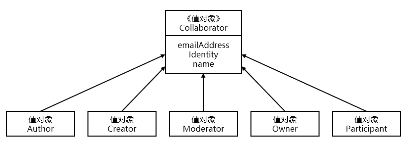

# 第6章 值对象


> 本章学习路线图
>
> - 学习如何将一个领域概念建模成值对象
> - 学习如何通过值对象来简化集成的复杂性
> - 学习以值对象来创建领域标准类型
> - 学习SaaSOvation是如何学到值对象的重要性的
> - 学习SaaSOvation是如何测试、实现和持久化值对象的


我们应该尽量使用值对象来建模而不是实体对象，因为我们可以非常容易地对值对象进行创建、测试和持久化对象的。

在设计的得当的情况下，我们可以对值对象实例进行创建和传递而不用担心被修改，甚至是使用后丢弃。那我们需要如何确定一个领域概念应该是建模成一个值对象呢？此时我们需要关注值对象的特征。

> 当你只关心某个对象的属性时，该对象便可以作为一个值对象。为期添加有意义的属性，并赋予它响应的行为。我们需要将值对象看成**不可变对象**，不要给它任何身份标识，还应该尽量避免像实体对象一样的复杂性。


## 值对象的特征

当你决定一个领域概念是否是一个值对象时，你需要考虑它是否有一下的特征：

- 它度量或者描述了领域中的一件东西
- 它可以作为不变量
- 它将不同的相关属性组合成一个整体概念
- 当度量或者描述改变时，可以用另一个值对象予以替换
- 它可以和其他值对象进行相等性比较
- 它不会对协作对象造成副作用

对于以上特征，将在下文做详细说明。在使用该方法分析模型时，你会发现很多领域概念都可以被设计成值对象。


### 度量或描述

值对象不应该成为领域中的一件东西，而只是用于度量或者描述领域中的某件东西的一个概念。例如一个人拥有年龄，但年龄并不是一个实在的东西，只是作为出生多少年的一种度量。

该特征和下面的“整体概念”特征是紧密联系在一起的。


### 不变性

一个值对象在创建之后便不能概念了。例如在Java中，我们使用构造函数来创建对象实例，此时传入的参数包含了该值对象所有状态所需的数据信息。传入的参数即可以作为值对象的直接属性，也可以用于计算出新的属性。值对象初始化之后，任何方法都不能对该对象的属性状态进行修改。

> 某些情况下，ORM或序列化框架可能需要setter方法来重建对象。

根据需要有时我们可以在值对象中维持实体对象的引用，这种情况下，实体对象的状态发生改变后，引用它的值对象也会发生改变，由此违背了值对象的不变性。因此，在值对象中引用实体时，我们的出发点应该是不变性、表达性和方便性。


### 整体概念

一个值对象可以只处理单个属性，也可以处理一组相关联的属性。在这组相关联的属性中，每一个属性都是整体属性不可或缺的组成部分。例如值对象{100人民币}，一个是100，一个是人民币。只有当两者组合在一起才是一个表达货币度量的概念。

```java
// 不正确的建模
public class ThingOfWorth {
    private String name;
    private BigDecimal amount;
    private String currency;
}
```

要正确的表达货币概念，我们不应该将两个属性分离开，应该是一个整体值对象。

```java
public final class MonetaryValue implements Serializable {
    private BigDecimal amount;
    private String currency;
    // 构造函数
}
```

改进后的例子

```java
// 正确的建模
public class ThingOfWorth {
    private ThingName name;
    private MonetaryValue worth;
}
```

上述示例代码中name的类型使用ThingName。它可以将与name有关的所有逻辑操作（如首字母大写）集中在一起。这样ThingOfWorth只包含了2个具有专属类型的资产属性。

值对象的构造函数用于保证概念整体的有效性和不变性，在初始化后就不允许对值对象做进一步修改了。

> 总结：
>
> 如果你试图将多个属性加在一个实体上，但这样却弱化了各个属性之间的关系，那么就应该考虑将这些相互关联的属性组合在一个值对象中。每一个值对象都是一个内聚的整体概念，它表达了通用语言中的一个概念。如果其中一个或多个属性发生了改变，那么可以考虑对整体值对象进行替换。


### 可替换性

在你的模型中，如果一个实体所引用的值对象能够正确地表达其当前的状态，那么这种引用关系可以一直维持下去。否则我们需要将整个值对象替换成一个新的值对象的实例。

```java
FullName name = new FullName("zhang", "san");
// ...
name = new FullName("li", "si");
```

如上述栗子，我没并没有使用FullName来的某个方法来改变其自身的状态，这样破坏了值对象的不变性。我们使用了简单的替换将另一个FullName实例的引用重新赋值给了name变量。


### 值对象的相等性

相等性通过比较两个对象的类型和属性来决定，如果两个对象的类型和属性都相等，那么这两个对象也是相等的。

```java
public boolean equals(Object obj){
    boolean isEqual = false;
    if (obj !=null && this.getClass() == obj.getClass()){
        FullName typeObj = (FullName) obj;
        isEqual = this.firstName().equals(typeObj.fistName()) && this.lastName().equals(typeObj.lastName());
    }
    return isEqual;
}
```

> 在Java中，equals()方法和hashCode()方法通常同时出现。

思考下值对象的哪些特征可以用来支持**聚合（10）**的唯一标识？我们需要值对象的相等性，比如在通过实体标识查询聚合时便会用到。同时实体的唯一标识不能改变，这可以部分地通过值对象的不变性达到。


### 无副作用行为

一个对象的方法可以设计成一个**无副作用函数**，这里的函数表示某个对象的操作，它只用于产生输出，而不会修改对象的状态。对于不变的值对象来说，所有的方法都必须是无副作用的，因为他们不能破坏值对象的不变性。


## 最小化集成

当模型 概念从上游上下文流入到下游上下文中时，尽量使用值对象来表示这些概念。这样的好处是可以达到最小化集成，即可以最小化下游模型中由于管理职责的属性数目。

重用限界上下文中的一个栗子：上游的*身份与访问上下文*会影响下游的*协作上下文*。即在身份与访问上下文中，两个聚合分别为User和Role。在协作上下文中关心的是一个User是否拥有特定的Role，比如Moderator。

值对象Collaborator的类层级。只有少数几个属性来自上游上下文，因为此时的类名已经能够表示出“角色”的概念了。




## 用值对象表示标准类型

**标准类型**是用于表示事务类型和描述性对象。系统中既有表示事物的实体和描述实体的值对象，同时还存在标准类型来区分不同的类型。如PhoneNumber值对象，对于家庭电话、移动电话、工作电话还是其他类型的电话号码，如果给每个类型创建一个类会非常困难。此时需要使用标准类型来描述不同类型的电话号码。

> 简单来说，在java中使用枚举类型来对类型进行标准化呈现，防止因为实现过程中的疏忽导致类型错误，如错别字等。

以成员类型USER和GROUP为例，使用java的枚举来表示：

```java
public enum MemberType {
    GROUP {
        public boolean isGroup() {
            return true;
        }
    }, USER {
        public boolean isUser() {
            return true;
        }
    };

    public boolean isGroup() {
        return false;
    }

    public boolean isUser() {
        return false;
    }
}
```

此时当一个User或一个Group被指派给某个Group是，可以通过标准类型来指明接收的类型。

```java
protected GroupMember toGroupMember(){
    return new GroupMember(this.tenantId(),
                           this.username(),
                           MemberType.USER);//标准枚举类型
}
```


## 测试值对象

为了强调测试驱动，在实现值对象之前，我们可以通过模拟客户端对值对象的使用，这些测试可以驱动出对领域模型的设计。在设计领域模型时，从客户端的角度思考有助于捕获关键的领域概念。否则我们便是从自己的角度设计模型，而不是业务的角度。

> 书中下文以*敏捷项目管理上下文*的核心域中的“待定项的业务优先级”为例，通过逐步分析测试给出了值对象BusinessPriority创建的过程。

在创建测试时，我们应该保证领域专家能够读懂这些测试，即测试应该具有领域含义。


## 实现

本章节展示如何将值对象BusinessPriority用作**策略模式**。

```java
public final class BusinessPriority implements Serializable {
    private static final long serialVersionUID = 1L;
    private BusinessPriorityRatings ratings;
    public BusinessPriority(BusinessPriorityRatings aRatings) {
        super();
        this.setRatings(aRatings);
    }
    public BusinessPriority(BusinessPriority aBusinessPriority) {
        this(aBusinessPriority);
    }
}
```

通常来说，作者会为值对象创建两个构造函数，一个接收用于构建对象状态的所有属性参数，它是主要的构造函数；另一个用于将一个值对象复制到另一个新的值对象，即复制构造函数。

策略模式实现以及Java对象相关的标准方法略。主要是这些行为都不会改变实例的自身状态。在各个行为执行完毕之后，需要在测试中验证状态的不变性。

一个对象的setter和getter方法并不见得只局限于设置对象的属性值，还可以进行断言操作，这对于通常的软件开发和DDD模型来说很重要。

对参数的合法性进行断言成为守卫，此时的断言保护着对象，使其处于一种合法的状态。守卫断言能够并且应该用于任何有可能接受错误参数的地方。


## 持久化值对象

通常来说，持久化过程即是将对象序列化成文本格式或者二进制格式，然后将其保存到计算机磁盘中。本章重点在于如何持久化包含有值对象的聚合实例。

> 后面讨论假设对聚合实体的读取和保存通过**资源库（12）**完成，聚合所包含的值对象随着该聚合的持久化和持久化。
>
> 以下具体的示例详见书中说明。


### 拒绝由数据建模泄露带来的不利影响

**根据模型来设计数据模型，而不是根据数据模型来设计领域模型。**

无论你使用什么技术来完成数据建模，数据库实体、主键、引用完整性和索引都不能用来驱动你对领域概念的建模。DDD不是关于如何根据范式来组织数据的，而是在一个一直的限界上下文中建模一套通用语言。在这个过程中，我们应该尽量避免数据模型从你的领域模型泄露到客户端中。


### ORM与单个值对象

本节通过示例展示由Hibernate的xml配置和MySql的建表语句分别创建一个值对象映射数据库字段的方法。


### 多个值对象序列化到单个列中

参考Hibernate的自定义类型，将Set或List集合映射到数据库的单个列中。


### 使用数据库实体保存多个值对象

使用委派身份标识（主键）的方式进行关联。（连表查询）


### 使用联合表保存多个值对象

这种方式简单地将值对象的集合元素保存到一个单独的数据库表中，然后在该表中维护一个领域实体所对应表的外键关联指向实体数据库ID。这样就可以通过ID重建该值对象集合。


### ORM与枚举状态对象

需要专门做持久化处理，参考书中示例。


