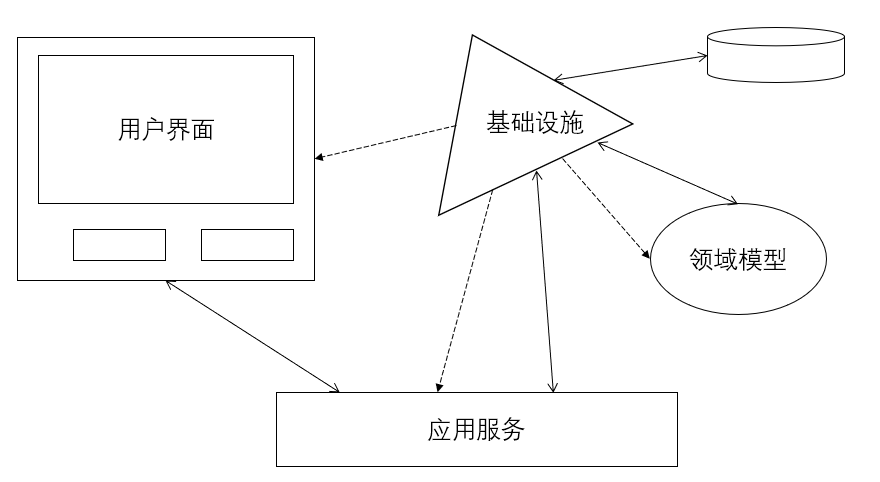
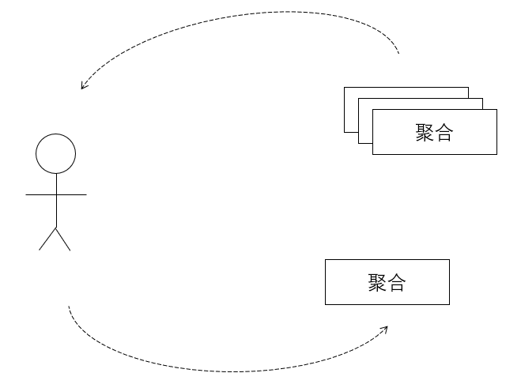

# 第14章 应用程序

> 本章学习路线图
>
> - 学习用户界面渲染领域模型的几种方法
> - 学习如何实现应用程序，以及它所提供的操作
> - 学习将输出从应用服务解耦的几种方式，以及不同的客户端类型
> - 学习为什么需要在用户界面中组合多个模型，以及如何实现
> - 学习将基础设施用于应用程序的技术实现的几种方式

应用程序通过用户界面向外展示领域模型的概念，并且允许用户在模型上执行各种操作，用户界面使用应用服务来协调用例任务，管理事务并执行一些必要的安全授权。

书中使用“应用程序”表示哪些支撑核心域（2）模型的组件，通常包含领域模型本身、用户界面、内部使用的应用服务和基础设施组件等。至于这些组件中应该包含什么，这是根据应用程序的不同而不同的，并且有可能受到架构（4）的影响。

## 用户界面

本章讲的是更加·宽泛的用户界面类型，如：

- 纯粹请求-应答式Web界面，也称为Web1.0。
- 基于Web的富互联网应用用户界面，也称为Web2.0。
- 本地客户端GUI，其中包括一些类库。

使用以上任何一种用户界面，首先我们都得回答以下问题：如何将领域对象渲染到用户界面的显式中？反之，如何将用户操作反应到领域模型上？

### 渲染领域对象

一般用户界面通常都需要渲染多个聚合（10）实例的中的属性，尽管用户最终只会修改其中一个聚合实例。

### 渲染数据传输对象

**DTO（Data Tranfer Object）**包含需要显示的所有·属性值。应用服务通过**资源库（12）**读取所需要的聚合实例，然后使用一个DTO组装器将需要显示的属性值映射到DTO中。之后用户界面组件将访问每一个DTO属性值，并渲染到显示界面中。

我们需要慎重设计，因为我们不应该暴露出太多的聚合内部结构。

### 使用调停者发布聚合的内部状态

我们可以使用调停者来解决客户端和领域模型之间的耦合问题，即**双分派**和**回调**。聚合调用调停者接口来发布内部状态。

### 通过领域负载对象渲染聚合实例

将多个聚合实例中需要显示的数据汇聚到一个**领域负载对象（Domain Payload Object）**。DPO中包含了对整个聚合实例的引用，而不是单独的属性。

### 聚合实例的状态展现

我们应该基于用例来创建状态展现，而不是基于聚合实例。更准确的是讲REST资源看做一个单独的模型——**视图模型（View Model）**或**展现模型（Presentation Model）**。

### 用例优化资源库查询

我们可以在资源库中创建一些查询方法，这些方法返回的是所有聚合实例属性的超集。查询方法动态地将查询结果放在一个**值对象**中。

> 类似数据库提供的存储过程？

### 处理不同类型的客户端

应用服务可以使用一个数据转换器，然后由客户端来决定需要使用的数据转换器类型。应用层将双分派给数据转换器以生成所需的数据格式。

### 渲染适配器以及处理用户编辑

略

## 应用服务

应用服务是领域模型的直接客户，放在什么样的逻辑位置，请参考**架构（4）**。应用服务负责用例流的任务协调，每个用例流对应了一个服务方法。应用服务应该做成很薄的一层，并且只使用聚合、值对象或领域服务来协调对模型的任务操作。

本章使用*管理身份与访问上下文*中的Tenant来做示例说明，详见书中分析过程和代码样例。

