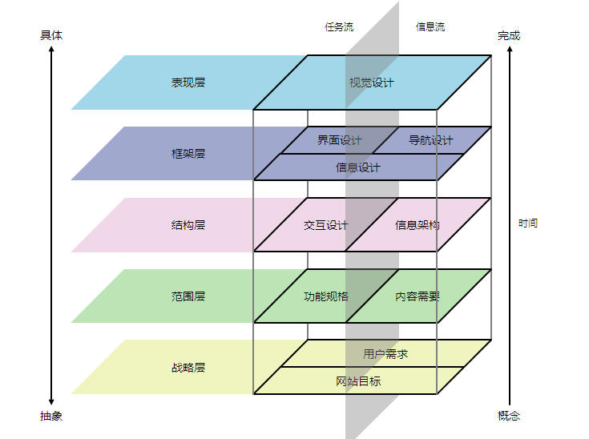

# 《用户体验要素》读书笔记摘抄

 

> 人们使用的每一件产品都具有用户体验。——作者

 

2021年12月：

这是我在从开发转方向做了一年产品/系统设计后，得空开始的学习**如何做好一个产品**以及**设计这个角色需要的储备**。当然现在也还没有做到产品经理这个角色，多的还是根据下达的需求做系统设计，经常在处理一线问题或向用户解释如何使用，却很少思考为什么会出现这种情况，哪些问题可以在源头就规避掉（当然bug这种就没的说了😂）。

凡事预则立，既然要做那就做好，现在也开始有意识的去思考产品本身，如何提升用户使用习惯以及减少用户的吐槽。这篇博客主要还要是整理个人认为书中对我意识比较有提升的内容，做一些简单的汇总和批注。希望不久的将来，我能结合自己的工作经历分享出自己的思考。

当前所做的产品是面向2B用户的运维工具，一些看法还是结合自己工作场景给出的，和书中描述的一些2C场景有所区别，但是书中的精髓却不受这些影响。。

 

## 用户体验为什么如此重要

 

用户体验对你很重要，其中一个最大的理由是：**它对你的用户很重要**。如果你没有给他们一个积极的体验，他们不会使用你的产品。

**好的用户体验不一定成就一个产品，但是坏的用户体验绝对可以毁掉一个产品**。

 

## 认识用户体验要素

 

用户体验的整个开发流程，都是为了确保用户在你的产品上的所有体验不会发生在你“明确的、有意识的意图”之外。这就是说，要考虑到用户有可能采取的每一个行动的每一种可能性，并且去理解在这个过程的每一个步骤中用户的期望值。

创建吸引人的、高效的用户体验的方法称为**以用户为中心的设计**（user-centered design）。以用户为中心的设计思想非常简单：在开发产品的每一个步骤中，都要把用户纳入考虑范围内。

网站看起来是什么样子，它如何运转，它能让你做什么，这些体验的背后是由一系列完整的大大小小的决策组成的。书中将一个网页如何给带来的用户体验分为了五个层面，自上而下分别是：**表现层**、**框架层**、**结构层**、**范围层**、**战略层**。

 

 

- 表现层（surface）：在表现层看到的是一些列网页，由文字、图片和动画通过不同的形式组成。

  > 注：书中只有文字和图片，此处增加了动画来表示网页中一些特殊的渲染展示效果。

- 框架层（skeleton）：在表现层之下是网站的框架层，按钮、空间、图片和文本区域的位置。框架层用于优化设计布局，以达到这些元素的最大效果和效率。

- 结构层（structure）：与框架层相比更抽象的是结构层，框架是结构的具体表达方式。框架层确定了在页面上交互元素的位置；而结构层则用来设计用户如何如何达到这个页面，并且在他们做完事情之后能去什么地方。例如框架层定义了导航条上各要素的排列方式，结构层则确定哪些类别应用应该出现在那里。

- 范围层（scope）：结构层确定网站的各种特性和功能最适合的组合方式，而这些特性和功能就构成了网站的范围层。任何一个功能是否应该成为这个网站的功能之一，就属于范围层要解决的问题。

- 战略层（strategy）：网站的范围基本上是由战略层所决定的。这些战略不仅仅包括了经营者想从网站的到什么，还包括了用户想从网站上得到什么。

 

在每一个层面中，要处理的问题有的抽象、有的则更具体。在底层，完全不用考虑网站、产品或最终服务的外观——我们只关心网站如何满足我们的战略（同时也满足用户的需求）。在顶层，只关心产品所呈现的最具体的细节。随着层面的上升，我们要做的决策一点一点地变得具体，并涉及越来越精细的细节。

 

> 按照个人的理解对五层内容做了一句话描述：
>
> - 战略层：为什么要做/给谁做？
> - 范围层：做哪些？
> - 结构层：怎么放？
> - 框架层：怎么放？
> - 表现层：怎么看？

 

## 一、战略层

 

> 成功的用户体验，其基础是一个明确表达的“战略”。知道企业与用户双方对产品的期许和目标，有助于促进用户体验各方面战略的确立和制定。

 

通常一款产品的失败原因并不在于用户体验或技术实现，而是在产品搭建之前没有人明确回答2个问题：

- **我们通过这个产品要获得什么？**
- **用户通过我们的产品能获得什么？**

概括来看，就是**产品目标**和**用户需求**两个问题，是我们在设计用户体验过程中做的每一个决定的基础。当我们越清楚地表达我们想要什么，以及确切地知道其他人想要从我们这里的到什么时，我们就能越精确地满足双方的需求。

 

### 01 产品目标

归根结底产品目标是为了满足以下一个或两个：替公司赚钱或替公司省钱。为了这两个目标，网站到底应该做什么？我们应该在充分了解问题之后再得出结论。明确地定义“成功的条件”，而不是“成功的路径”。

 

### 02 用户需求

抛弃自己立场的局限性，从用户角度审视网站。我们需要定义**谁是我们的用户**，在此基础上弄清用户需要什么。对目标用户进行充分调研，了解用户在使用我们的产品时，他们想要什么，同时也能帮助我们确定这些需求的优先级。

> 有时候目标用户也不知道自己的需求是什么，就需要我们通过**洞察**来挖掘用户痛点，引导用户需求。

 

用户细分：我们将用目标户分成更小的群组，每一群用户都是具有某些共同关键特征的用户组成。创建细分用户群的重要原因，不仅是因为不同的用户群有不同的需求，还因为有时候这些需求是矛盾的。

> 我参与的工具即面向客户、也面向给客户的打工人，以及打工人的领导。这三类用户群对于工具的使用场景不同，就带来了不同的需求。从打工人到打工人领导再到客户，关注面从细到粗。

 

### 03 成功标准

理解你的目标，有一个最重要的部分，就是理解你要怎样才能知道“什么时候到达了终点”。这就是**成功标准**：一些可追踪的指标，产品上线后用来显示它是否满足了我们自己的目标和用户的需求。

> 对于具体的特性也叫**验收标准**，即这个特性上线后是否满足了具体的用户需求。

 

2B场景来说，用户最大的需求总结下来就是四个字：==**降本增效**==。可以围绕这个出发点进行端到端需求闭环。

 

## 二、范围层

 

> 带着“我们想要什么”和”我们的用户想要什么“的明确认识，我们才能弄清除如何去满足这些战略的目标。当你把用户需求和产品目标转变成产品应该提供给用于什么样的内容和功能时，战略就变成了范围。

 

### 01 范围层定义

定义项目范围同时在做两件事情：这是一个有价值的过程，同时能产生有价值的产品。

**过程**的价值在于，当整个事情还处于假设阶段的时候，它能迫使你去考虑潜在的冲突和产品中一些粗略的点。我们能确定现在解决哪些事情，而哪些必须要迟一些才能解决。

**产品**的价值在于，被定义的产品给了整个团队一个参考点，明确了项目中要完成的全部工作。定义好你的要求能保证在设计过程中不出现模棱两可的情况。

> 注：对于过程的理解包括但不限于如下的情况，只有为了满足这个”过程“需要参与的元素才是整个项目涉及的范围，至于元素，可以是项目/需求管理的一环，可以是系统架构中的一个必要组件 ，可以是用户一步一步创建任务的操作过程。
>
> - 特性需要经过的生命周期整个过程
> - 通过什么样的过程/方法去解决用户需求
> - 用户为了某个需求在使用产品经过了什么步骤/操作
>
> 对于产品的理解：为了满足用户需求所实现的特性的集合。书中提到了产品价值之一是提供了共同语言，就是我们描述**过程**时用到的术语是同一个，不会出现沟通上的偏差。比如我说的[ES](https://www.elastic.co/cn/elasticsearch/)是数据库，对方就不会理解为我想跟他讨论雷克萨斯ES车型😄。

 

### 02 定义需求

> 书中是用**特性**来同时表示软件的功能和所提供的内容。
>
> 在软件开发中，范围层确定的是全部的功能需求或功能规格。
>
> 需求的详略程度取决于该项目的具体范围。

产品经理通过用户、运营、市场等各个渠道收集到用户需求。再结合战略层确定的目标对需求进行分析、筛选和过滤，最终形成一份完整的产品需求说明书/功能规格说明书。需求说明书的作用是将**产品需要做什么**和**产品不需要做什么**明确下来。[之前看很多人把范围层理解为“用户需求”，但其实应该是更具象一点的东西，即通过“用户需求”推导出的产品内容需求和功能规划。](http://www.woshipm.com/pd/4198637.html#:~:text=%E4%B9%8B%E5%89%8D%E7%9C%8B%E5%BE%88%E5%A4%9A%E9%93%81%E6%B1%81%E6%8A%8A%E8%8C%83%E5%9B%B4%E5%B1%82%E7%90%86%E8%A7%A3%E4%B8%BA%E2%80%9C%E7%94%A8%E6%88%B7%E9%9C%80%E6%B1%82%E2%80%9D%EF%BC%8C%E4%BD%86%E5%85%B6%E5%AE%9E%E5%BA%94%E8%AF%A5%E6%98%AF%E6%9B%B4%E5%85%B7%E8%B1%A1%E4%B8%80%E7%82%B9%E7%9A%84%E4%B8%9C%E8%A5%BF%EF%BC%8C%E5%8D%B3%E9%80%9A%E8%BF%87%E2%80%9C%E7%94%A8%E6%88%B7%E9%9C%80%E6%B1%82%E2%80%9D%E6%8E%A8%E5%AF%BC%E5%87%BA%E7%9A%84%E4%BA%A7%E5%93%81%E5%86%85%E5%AE%B9%E9%9C%80%E6%B1%82%E5%92%8C%E5%8A%9F%E8%83%BD%E8%A7%84%E5%88%92%E3%80%82)

 

书中提供的撰写功能规格书的几条规则：

- **乐观**： 在描述需求时，总会遇到一些意外的情况。对于这些意外的情况，我们应该以积极的角度去描述。
   例如这样描述：
   `“如果用户余额不足，不允许用户支付。”`
   阅读者并不知道下一步的动作是如何的。应该以更积极的方式来描述，可以改成：
   `“如果用户余额不足，则提示用户余额不足，并提示和引导用户进行充值。”`

- **具体**： 对于需求应该描述得更具体和详细。以便文档的阅读者可以更好的理解需求。
   例如这样描述，则不是很具体：
   `“突出显示用户关注的内容。”`
   这个需求可以更具体的表达为：
   `“用户点了关注的内容，放在内容列表的最前端。”`

- **客观**
   对于需求的描述应该避免用主观的语气，应该主观的语气容易让阅读者理解有歧义。
   例如如下表达，存在着歧义：
   `“提供便捷的登陆方式。”`
   不同的人对“便捷”的理解方式不一样，可以改成这样：
   `“支持使用手机号码和短信验证码直接登陆系统。”`

 

### 03 需求优先级

在战略目和需求标之间，几乎看不到一对一的简单关联。有时一个需求可以满足多个战略目标。同样，一个战略目标也常常产生多个不同的需求。由于项目范围是简历在战略层的基础上，因此我们应该去评估这些需求是否能满足战略目标。

由于技术、资源、时间、特性依赖等原因，我们需要充分权衡各个特性的优先级，才能得到一个连贯的、统一的产品。任何不符合当前项目的战略目标的特性建议，都要通过范围定义将其排除出去。

战略层让我们有了目标，但容易造成需求过多，难以闭环的情况。范围层就让我们对功能做了取舍和排期，进而引出了版本的概念。需求不能无限添加，产品经理一定要有优先级概念和版本控制思想。功能的取舍主要考虑行业，受众人群和竞品，以及公司的资源。

 

 

> [**战略——范围的关系是什么？**](http://www.woshipm.com/discuss/53005.html#:~:text=%E7%9A%84%E9%A6%96%E8%A6%81%E5%9B%A0%E7%B4%A0%E3%80%82-,%E6%88%98%E7%95%A5%E2%80%94%E2%80%94%E8%8C%83%E5%9B%B4%E7%9A%84%E5%85%B3%E7%B3%BB%E6%98%AF%E4%BB%80%E4%B9%88%EF%BC%9F,-%E6%88%98%E7%95%A5%E5%86%B3%E5%AE%9A%E8%8C%83%E5%9B%B4)
>
> 战略决定范围，功能承载产品价值，范围层是为了实现战略层意图。

 

## 三、结构层

 

> 在定义好用户需求并排列好优先级别之后，我们对于最终产品将会包含什么特性已经有了清楚的轮廓。然而，这些需求并没有说明如何将这些分散的片段组成一个整体。这就是范围层的上面一层：为网站创建一个概念结构。

 

结构层是五个层面中的第三层，它也适当地将我们的关注点吃那个抽象的决策与范围的问题，转移到更能影响最后的用户体验的具体问题。范围层决定了产品定位后，功能规格后，结构层是用来设计用户通过怎样的流程能够满足他们的需求，并且要考虑他们完成事情之后能够去哪里。

 

### 01 结构层定义

在传统的软件开发行业，设计“为用户设计结构化体验”的方法被成为**交互设计**。在内容建设方面，主要是通过**信息架构**来构建用户体验。交互设计和信息架构都强调一个重点：确定各个将要呈现给用户的元素的**模式**和**顺序**。

 

### 02 交互设计

交互设计关注描述“可能的用户行为”，同时定义“系统如何配合与响应”这些用户行为。

> 交互设计（英文Interaction Design，缩写IXD)，是定义、设计人造系统的行为的设计领域，它定义了两个或多个互动的个体之间交流的内容和结构，使之互相配合，共同达成某种目的。交互设计努力去创造和建立的是人与产品及服务之间有意义的关系，以“在充满社会复杂性的物质世界中嵌入信息技术”为中心。交互系统设计的目标可以从“可用性”和“用户体验”两个层面上进行分析，关注以人为本的用户需求。

 

用户对于“交互组件将怎么样工作”的观点称为**概念模型**。规划好概念模型能帮助你做出一致的设计决定。内容元素是一个位置还是对象并不重要；重要的是网站能够将这些元素从头到尾一致地表现出来，而不是有时候将此元素当成位置，有时候又当成对象。

> eg：电商购物时“购物车”是一个能“放入”或“取出”物品的容器，该模型参考的就是现实世界中的实物，会影响到我们界面上的视觉设计以及使用的描述用语。

 

概念模型是用于在交互设计的开发过程中保持使用方式的一致性。了解用户对于网站模式的想法可以帮我们挑选最有效的概念模型。理想情况下不用告诉用户我们使用的是什么模型，用户会根据自己的使用直觉进行评判。

> 比如我们运维工具，提供了多种功能，这些功能的使用流程是否和一线维护人员的使用习惯相匹配，各个操作的顺序以及菜单/按钮文字描述是否符合业界习惯等，都是需要提前设计好。但是如果你先去跟用户沟通想要个什么样子/流程/操作的界面集（不是单一元素的样式），大多数情况他们也无法给出很好的建议或想法。这个时候需要我们根据用户的使用场景给出合理的规划。

 

任何一个交互设计的项目都有很大部分牵扯处理“用户错误”（参考小故事：测试工程师走进了酒吧）。第一个同时也是最好的防止错误的办法，是将系统设计成不可能犯错的那种；第二个避免错误的方法就是使错误难以发生，但即使如此，一些错误一定会发生，这时系统应该帮助用户找出错误并引导改正他们。有效的错误信息和容易自我解释的界面可以在错误发生之后帮助用户纠正。

交互设计会处理每一个级别的错误，以确保更高比例的用户能有积极的体验。

 

### 03 信息架构

只要人与人之间有信息要传达，就必须要选择组织这些信息，以确保别人能理解并使用他它们。信息架构研究的是人们如何认识信息的过程，对于产品而言，信息架构关注的就是呈现给用户的信息是否合理并具有意义。

 

在以内容为主的网站上，信息结构主要的工作室设计组织分类和导航的结构，让用户可以高效率、有效的浏览网站的内容。信息架构与信息检索的概念密切相关：**设计出让用户容易找到信息的系统**。同样信息架构要求创建分类体系，这个分类体系将会对应并符合我们的网站目标、希望满足的用户需求，以及将被合并在网站中的内容。我们可以使用两种方式来建立分类体系：从上到下或从下到上。

- **从上到下**的信息架构方法将从战略层所考虑的内容，即根据产品目标和用户需求直接进行结构设计。

  > 从上到下的架构方法是由战略层驱动的。

- **从下到上**的信息架构方法是根据对“内容和功能需求的分析”而来的，从已有资料开始向上汇总，从而逐渐构建出能反应我们的产品目标和用户需求的结构。

  > 从下到上的架构方法是由范围层驱动的。

两个方法都有一定的局限性。从上到下的架构方法有时可能导致内容的重要细节被忽略。从下到上的方法则可能导致架构过于精确地反应了现有内容，从而不能灵活地容纳未来内容的变动。因此需要在两种方法上找到平衡。

 

信息架构的基本单位是节点，对应任意的信息片段或组合。常见的几种类型有：层级结构，矩阵结构，自然结构，线性结构。

 

### 04 架构图

文档一定要描述清除网站的结构——从命名原则和元数据的具体细节，到信息架构和交互设计的整体概况。然后信息架构或交互设计的主要文档是示意图。视觉化的呈现结构，是表述“分支、群组、组件之间的联系”的一种最高效的方式。架构图最重要的是记录概念关系：哪些类别应该放在一起，而哪些需要保持独立？在交互过程中那些步骤要怎么样相互配合？

作者提供了一种方式来规范化表示网站的构思，使用一组图形并给每个图形的含义做出来明确的定义，称为**视觉辞典**。

TODO：示意图

 

## 四、框架层

> 在冲满概念的结构层中开始形成了大量的需求，这些需求都是来自我们的战略目标的需求。在框架层，我们要进一步提炼这些结构，确定很详细的界面外观、导航和信息设计，这能让晦涩的结构变得更更实在。

界面设计、导航设计和信息设计

## 五、表现层

> 在这个五层模型的顶端，我们把注意力转移到产品用户会首先注意到的地方：感知设计。这里 ，内容、功能和美学汇聚到一起来产生一个最终设计，完成其他四个层面的所有目标，并同时满足用户的感官感受。

感知设计

## 要素的应用

参考资料：

[用户体验要素的五层模型 - 知乎 (zhihu.com)](https://zhuanlan.zhihu.com/p/159043777)

[用户体验五要素你用对了吗？ | 人人都是产品经理 (woshipm.com)](http://www.woshipm.com/pd/4198637.html)

[从用户体验五要素出发，谈如何设计与体验一款产品 | 人人都是产品经理 (woshipm.com)](http://www.woshipm.com/pd/3006382.html)

[聊聊用户体验的五个要素 - 简书 (jianshu.com)](https://www.jianshu.com/p/00be8467904d)

## 附录：

### 