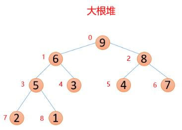
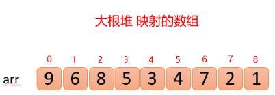
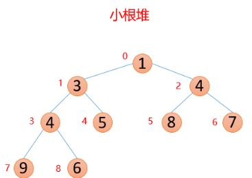
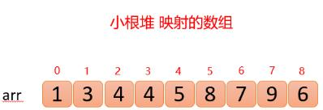

# 算法分享：堆排序

## 堆排序基本概念

堆的结构可以分为大根堆和小根堆，是一个[完全二叉树](https://baike.baidu.com/item/完全二叉树/7773232?fr=aladdin)，而堆排序是根据堆的这种数据结构设计的一种排序，

首先介绍什么是大根堆和小根堆

性质：

- **大根堆**：每个结点的值都大于等于其左孩子和右孩子结点的值。

  

  大根堆映射的数组为：

  

- **小根堆**：每个结点的值都小于等于其左孩子和右孩子结点的值。

  

  小根堆映射的数组为：

  

注：与搜索二叉树不同，没有要求说大根堆中一定要小的值在左边，大的值在右边。

基本概念：查找数组中某个数的父结点和左右孩子结点，比如已知索引为**i**的数，那么

1. 父结点索引：(i-1)/2（这里计算机中的除以2，省略掉小数）

2. 左孩子索引：2*i+1

3. 右孩子索引：2*i+2

所以上面两个数组可以组成堆结构，因为他们满足堆的定义性质：

大根堆：`arr(i)>arr(2*i+1) && arr(i)>arr(2*i+2)`

小根堆：`arr(i)<arr(2*i+1) && arr(i)<arr(2*i+2)`

## 堆排序基本思路：

以将无序数组构造成大根堆为例：（其中升序用大根堆，降序就用小根堆）

1. 首先将待排序的数组构造成一个大根堆，此时，整个数组的最大值就是堆结构的顶端

2. 将顶端的数与末尾的数交换，此时，末尾的数为最大值，剩余待排序数组个数为n-1

3. 将剩余的n-1个数再构造成大根堆，再将顶端数与n-1位置的数交换，如此反复执行，便能得到有序数组

参考资料：

- [堆排序算法（图解详细流程）](https://blog.csdn.net/u010452388/article/details/81283998)
- [Java常见排序算法详解——堆排序](https://www.jianshu.com/p/73ef54fb99f4)
- [白话讲排序系列（六） 堆排序（绝对让你明白堆排序！）](https://blog.csdn.net/u013384984/article/details/79496052)