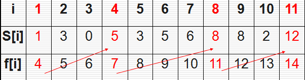

# 算法分享之贪心算法

文章开始，先从两个简单的算法题开始引出我们今天的分享内容。

#### 1. 找零钱问题

这是一个在我们以前生活中很普遍的问题，假设1元、2元、5元、10元、20元、50元、100元的纸币分别有c0, c1, c2, c3, c4, c5, c6张。现在要用这些钱来支付K元，至少要用多少张纸币？

我们在每一步尽可能用面值大的纸币即可，而这种也比较符合我们正常的逻辑思维方式。

```java
private static final int[] VALUE = new int[]{100, 50, 20, 10, 5, 2, 1};

public static void usingCache(int target) {
    Map<Integer, Integer> map = new LinkedHashMap<>();
    for (int i = 0; i < VALUE.length; i++) {
        int count = 0;
        while (target >= VALUE[i]) {
            count++;
            target -= VALUE[i];
        }
        map.put(VALUE[i], count);
    }
    for (Map.Entry<Integer, Integer> entry : map.entrySet())
        if (entry.getValue() > 0)
            System.out.println(String.format("面值[%d]元纸币使用[%d]张", entry.getKey(), entry.getValue()));
}
```


#### 2. 活动选择问题

这是《算法导论》上的例子，也是一个非常经典的问题。有n个需要在同一天使用同一个教室的活动$a_1,a_2,…,a_n$，教室同一时刻只能由一个活动使用。每个活动$a_i$都有一个开始时间$s_i$和结束时间$f_i$ 。一旦被选择后，活动$a_i$就占据半开时间区间$[s_i,f_i)$。如果$[s_i,f_i]$和$[s_j,f_j]$互不重叠，$a_i$和$a_j$两个活动就可以被安排在这一天。该问题就是要安排这些活动使得尽量多的活动能不冲突的举行。例如下图所示的活动集合S，其中各项活动按照结束时间单调递增排序。



考虑使用贪心算法的解法。为了方便，我们用不同颜色的线条代表每个活动，线条的长度就是活动所占据的时间段，蓝色的线条表示我们已经选择的活动；红色的线条表示我们没有选择的活动。
如果我们每次都选择开始时间最早的活动，不能得到最优解：


如果我们每次都选择持续时间最短的活动，不能得到最优解：


我们的贪心策略应该是**每次选取结束时间最早的活动**。直观上也很好理解，按这种方法选择相邻活动，为未安排活动留下尽可能多的时间。这也是把各项活动按照结束时间单调递增排序的原因。


## 正文

贪心算法的定义：
贪心算法是指在对问题求解时，总是做出在当前看来是最好的选择。也就是说，不从整体最优上加以考虑，只做出在某种意义上的局部最优解。贪心算法不是对所有问题都能得到整体最优解，关键是贪心策略的选择，选择的贪心策略必须具备无后效性，即某个状态以前的过程不会影响以后的状态，只与当前状态有关。
解题的一般步骤是：

1. 建立数学模型来描述问题；
2. 把求解的问题分成若干个子问题；
3. 对每一子问题求解，得到子问题的局部最优解；
4. 把子问题的局部最优解合成原来问题的一个解。

如果大家比较了解动态规划，就会发现它们之间的相似之处。最优解问题大部分都可以拆分成一个个的子问题，把解空间的遍历视作对子问题树的遍历，则以某种形式对树整个的遍历一遍就可以求出最优解，大部分情况下这是不可行的。贪心算法和动态规划本质上是对子问题树的一种修剪，两种算法要求问题都具有的一个性质就是子问题最优性(组成最优解的每一个子问题的解，对于这个子问题本身肯定也是最优的)。动态规划方法代表了这一类问题的一般解法，我们自底向上构造子问题的解，对每一个子树的根，求出下面每一个叶子的值，并且以其中的最优值作为自身的值，其它的值舍弃。而贪心算法是动态规划方法的一个特例，可以证明每一个子树的根的值不取决于下面叶子的值，而只取决于当前问题的状况。换句话说，不需要知道一个节点所有子树的情况，就可以求出这个节点的值。由于贪心算法的这个特性，它对解空间树的遍历不需要自底向上，而只需要自根开始，选择最优的路，一直走到底就可以了。