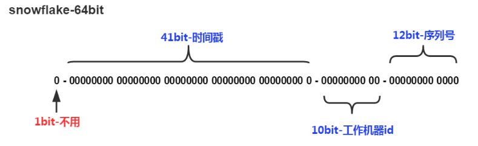
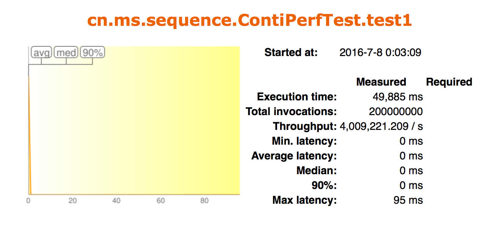

## 1 背景

在分布式项目中，在业务数据中需要生成一个全局唯一的序列号，比如：消息标识，订单标识，用户标识等等。同时对于id生成的要求如下： 

- 全局唯一 
- 趋势有序 
- 主键索引 方便排序 
- 高可用 
- 高并发

## 2 概述

​        基于Twitter的Snowflake算法（俗称雪花算法）实现64位自增ID算法。为了满足Twitter每秒上万条消息的请求，每条消息都必须分配一条唯一的ID，这些ID还需要一些大致的顺序（即时序性），并且在分布式系统中不同机器产生的ID必须不同。

SnowFlake算法生成id的结果是一个64bit大小的整数，它的结构如下图：

- `1位`，不用。二进制中最高位为1的都是负数，但是我们生成的id一般都使用整数，所以这个最高位固定是0
- `41位`，用来记录时间戳（毫秒）。
  - 41位可以表示$2^{41}-1$个数字，
  - 如果只用来表示正整数（计算机中正数包含0），可以表示的数值范围是：0 至 $2^{41}-1$，减1是因为可表示的数值范围是从0开始算的，而不是1。
  - 也就是说41位可以表示$2^{41}-1$个毫秒的值，转化成单位年则是$(2^{41}-1) / (1000 * 60 * 60 * 24 * 365) = 69$年
- `10位`，用来记录工作机器id。
  - 可以部署在$2^{10} = 1024$个节点，包括`5位datacenterId`和`5位workerId`
  - `5位（bit）`可以表示的最大正整数是$2^{5}-1 = 31$，即可以用0、1、2、3、....31这32个数字，来表示不同的datecenterId或workerId
- `12位`，序列号，用来记录同毫秒内产生的不同id。
  - `12位（bit）`可以表示的最大正整数是$2^{12}-1 = 4095$，即可以用0、1、2、3、....4094这4095个数字，来表示同一机器同一时间截（毫秒)内产生的4095个ID序号

由于在Java中64bit的整数是long类型，所以在Java中SnowFlake算法生成的id就是long来存储的。

SnowFlake可以保证：

- 所有生成的ID都是按时间趋势递增
- 整个分布式系统内不会产生重复ID
- 每个ID中都可以解读出，该ID是在哪个数据中心的哪台工作机器上产生
- 数值型的分布式ID（替换了UUID）
- 高性能的ID生成器（超高400w/s的超高性能）

## 03 性能测试数据

性能测试数据结果发现，QPS>400w/s（Mac Pro 4C/8GB）

## 04 缺点分析

- 强依赖机器时间，如果发生回拨会导致可能生成id重复
- 夸毫秒ID都是偶数

### 4.1 时间回拨

**产生原因**
        分布式环境，每台机器上的时钟不可能完全同步。由于机器时间不一致，需要同步各个服务器的时间而导致时间回拨的产生。

**解决方案**

- 在流量最低的时间段进行时间回拨，如半夜没有流量或流量很低时
- 每次批量获取一批ID（至少这批ID用完前，即可完成时间回拨）
- 调整ID存储的数据结构
- 回拨时间小于timeout时间，则通过自旋的方式进行生成
- 回拨时间大于timeout时间，则通过更换workid来生成（精度有所降低，如可从400w降低至100w，但也完全足够了）

### 4.2 大量偶数

**产生原因**
        根据上述算法可知，在同一毫秒内是通过一个自增序列号进行区分不同ID，当时间跳至下一毫秒时，自增ID就会被重置为0。因此，如果线上的交易并发量不是很大时（即都是夸毫秒产生时），生成的所有ID的尾号基本都是0，即基本都是偶数。如果直接应用该ID来做分库分表，则极有可能出现数据不均匀的情况。

**解决办法**

- 自增ID满值后再重置
- 重置时使用范围随机

## 6 Snowflake扩展

​        Snowflake算法并没有什么难度，其存放的数据区总长为64位，以上的数据区划分方式是Twitter给出的标准版，而算法是通用的。因此我们可以根据自己实际的需求，来制定属于我们自己的数据区（业界改造其数据存储结构的大牛也是不少的）。其次，以上算法生成的ID中存有一定是数据信息，因此我们可以解读这个ID来做更多的事，如获取出ID生成的时间、ID生成的数据中心、ID生成的机器ID等信息。